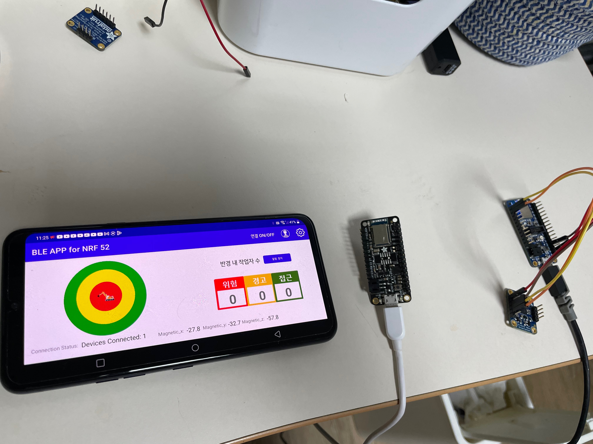
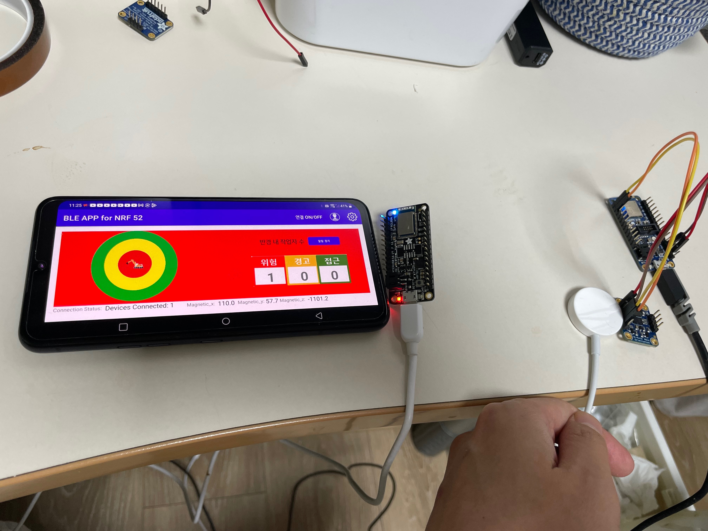
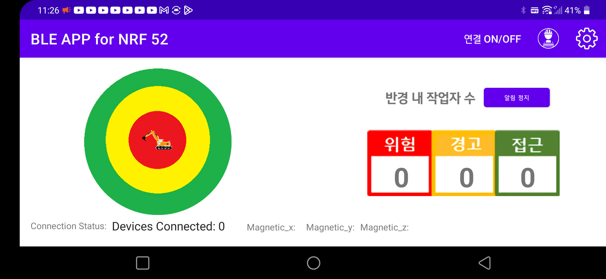
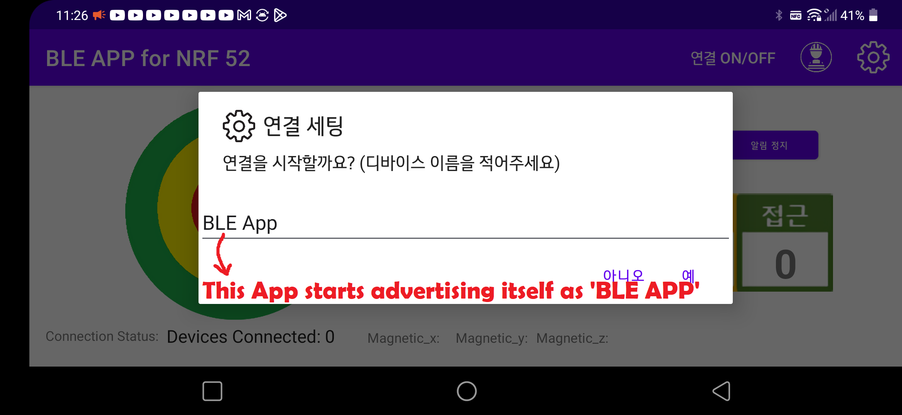
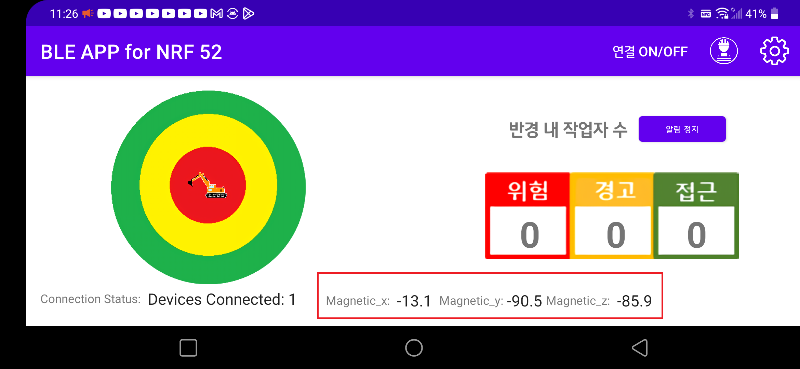
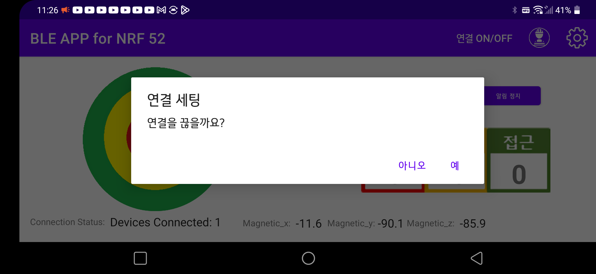

# BLEAppForNRF52

This project addresses the limited range of Bluetooth Low Energy (BLE) communication in real-world deployment scenarios. In physical environments, BLE signals are subject to substantial attenuation and interference, such that a single Feather board is often insufficient to establish a reliable connection with a user's mobile device located at a considerable distance. To address this limitation, an additional Feather board was introduced as a signal repeater positioned between the two endpoints.

Because a repeater situated between two devices must simultaneously establish connections with two independent peripheral devices on either side, the repeater was configured to operate in the central role. Accordingly, the mobile application was designated as a peripheral device, thereby enabling the intermediate node to initiate and manage both connections concurrently.

## License Information
This project is licensed for **personal use only**. Any academic or commercial use is strictly prohibited without the explicit permission of the author.
For more details, please refer to the [LICENSE](./LICENSE) file.
If you wish to use this software for academic or commercial purposes, please contact the author at [cbcc12345@hanyang.ac.kr] or [cbcc1234@gmail.com].
Unauthorized use may result in legal action.
