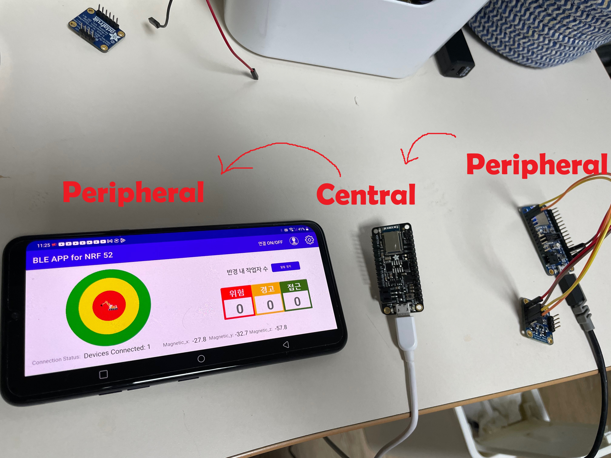

# BLEAppForNRF52

This project is to connect 3 devices in a row. In a physical world, the BT signal encounters too many disturbances, so using only 1 feather board we cannot reach the user holding phone if he or she is at quite a distance.
So I thought using one more feather board as a repeater would be better. 
I chose the app to be a peripheral not central, because a repeater in the middle of two devices should be central to connect to 2 individual peripheral devices on different sides.
